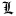
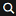
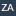

#  All Mangas Reader V2

## What is All Mangas Reader

All Mangas Reader is a browser extension which is designed to help you read and follow mangas on a lot of manga websites.

-   Read whole chapters on manga websites
-   Follow mangas you like with your reading list
-   Be notified when new chapters are published
-   Order, classify mangas in your reading list
-   A lot of supported websites
-   Synchronization across multiple devices

### Browser compatibility

<table>
    <thead>
        <tr align="center">
            <th colspan="2"></th>
            <th colspan="1">Quantum</th>
            <th colspan="6">Chromium</th>
        </tr>
    </thead>
    <tbody>
    <tr align="center">
        <td colspan=2></td>
        <td>
            
        </td>
        <td>
            
        </td>
        <td>
            
        </td>
        <td>
            
        </td>
        <td>
            
        </td>
        <td>
            
        </td>
        <td>
            
    </tr>
    <tr colspan="2" align="center">
        <td colspan=2><b>Desktop</b></td>
        <td>✔️</td>
        <td>✔️</td>
        <td>✔️</td>
        <td>✔️</td>
        <td>✔️</td>
        <td>✔️</td>
        <td>❌</td>
    </tr>
    <tr colspan="2" align="center">
        <td colspan=2><b>Mobile</b></td>
        <td>✔️</td>
        <td>❌</td>
        <td>❌</td>
        <td>❌</td>
        <td>❌</td>
        <td>❌</td>
        <td>✔️</td>
    </tr>
    </tbody>
</table>

### Supported websites

<details>
    <summary>Click to unfold</summary>
    <table>
        <tbody>
            <tr>
                <td></td>
                <td></td>
                <td></td>
                <td></td>
                <td></td>
                <td></td>
                <td></td>
                <td></td>
                <td></td>
                <td></td>
            </tr>
            <tr>
                <td></td>
                <td></td>
                <td></td>
                <td></td>
                <td></td>
                <td></td>
                <td></td>
                <td></td>
                <td></td>
                <td></td>
            </tr>
            <tr>
                <td></td>
                <td></td>
                <td></td>
                <td></td>
                <td></td>
                <td></td>
                <td></td>
                <td></td>
                <td></td>
                <td></td>
            </tr>
            <tr>
                <td></td>
                <td></td>
                <td></td>
                <td></td>
                <td></td>
                <td></td>
                <td></td>
                <td></td>
                <td></td>
                <td></td>
            </tr>
            <tr>
                <td></td>
                <td></td>
                <td></td>
                <td></td>
                <td></td>
                <td></td>
                <td></td>
                <td></td>
                <td></td>
                <td></td>
            </tr>
            <tr>
                <td></td>
                <td></td>
                <td></td>
                <td></td>
                <td></td>
                <td></td>
                <td></td>
                <td></td>
                <td></td>
                <td></td>
            </tr>
            <tr>
                <td></td>
                <td></td>
                <td></td>
                <td></td>
                <td></td>
                <td></td>
                <td></td>
                <td></td>
                <td></td>
                <td></td>
            </tr>
            <tr>
                <td></td>
                <td></td>
                <td></td>
                <td></td>
                <td></td>
                <td></td>
                <td></td>
                <td></td>
                <td></td>
                <td></td>
            </tr>
            <tr>
                <td></td>
                <td></td>
                <td></td>
                <td></td>
                <td></td>
                <td></td>
                <td></td>
                <td></td>
                <td></td>
                <td></td>
            </tr>
            <tr>
                <td></td>
                <td></td>
                <td></td>
                <td></td>
                <td></td>
                <td></td>
                <td></td>
                <td></td>
                <td></td>
                <td></td>
            </tr>
            <tr>
                <td></td>
                <td></td>
                <td></td>
                <td></td>
                <td></td>
                <td></td>
                <td></td>
                <td></td>
                <td></td>
                <td></td>
            </tr>
            <tr>
                <td></td>
                <td></td>
                <td></td>
                <td></td>
                <td></td>
                <td></td>
                <td></td>
                <td></td>
                <td></td>
                <td></td>
            </tr>
            <tr>
                <td></td>
                <td></td>
                <td></td>
                <td></td>
                <td></td>
                <td></td>
                <td></td>
                <td></td>
                <td></td>
                <td></td>
            </tr>
            <tr>
                <td></td>
                <td></td>
                <td></td>
                <td></td>
                <td></td>
                <td></td>
                <td></td>
                <td></td>
                <td></td>
                <td></td>
            </tr>
            <tr>
                <td></td>
                <td></td>
                <td></td>
                <td></td>
                <td></td>
                <td></td>
                <td></td>
                <td></td>
                <td></td>
                <td></td>
            </tr>
            <tr>
                <td></td>
                <td></td>
            </tr>
        </tbody>
    </table>
</details>

Your favorite website not listed yet? [Submit a request on discord](https://discord.gg/bdzk9hR)

### 🔐 Privacy

All Mangas Reader creates cookies to force English on the Webtoons website, and pass an "I am adult" cookie to websites that have verifications
for more explicit content. Not allowing AMR to read / create cookies will hinder or break compatibility with these websites. This option can
be turned off / on at any time from the settings menu.

<h2 id="#firefox-install"> Firefox</h2>

-   Download the latest stable version from the Mozilla add-ons explorer
    -   **[Stable](https://addons.mozilla.org/firefox/addon/all-mangas-reader/)**
-   Beta versions for firefox are available here :
    -   **[Beta](https://amr-releases.com/firefox/release/all-mangas-reader-beta-latest.xpi)**

<h2 id="#chromium-install"> Chromium</h2>
 
⚠️ **Chromium based browsers** need the following additional steps in order to install All Mangas Reader.  
If you are not sure your browser is based on chromium you can check our [Browser compatibilty](#browser-compatibility) list (or google it).
 
### Install AMR on a chromium browser
All Mangas Reader do not comply with Google Chrome Extensions terms of services, thus cannot be downloaded directly from their store.

1.  Click link below for the version you wish to use
    -   **[Stable](https://amr-releases.com/chrome/release/all-mangas-reader-latest.zip)**
    -   **[Beta](https://amr-releases.com/chrome/beta/all-mangas-reader-beta-latest.zip)**
2.  Extract the file .zip file you just downloaded to a location you wish to use for this extension, you will need to remember where this folder is in order to update the extension.
    -   **Windows**: Use the built in windows unzip via right click or [7zip](https://www.7-zip.org/download.html) to extract the file. ([how to extract file with 7z](https://www.webhostinghub.com/help/learn/website/managing-files/extract-file))
    -   **MacOS X** / **Linux**: open a terminal and use [unzip](https://superuser.com/a/1026504)
3.  Open the extensions page in your browser, enable developer mode and click `Load unpacked extension`.
4.  Select the folder you extracted to install AMR.

### Update AMR on a chromium browser

1. Download the lasted version of All Mangas Reader directly from within the extension when prompted  
   
2. Extract the file .crx file you just downloaded into your (already existing) All Mangas Reader's installation folder
3. Restart browser

## 📡 Synchronization

### Browser Sync

_Browser sync_ uses your browser capabilities to synchronize your manga list:  
⚠️**only works with Firefox**.

-   ✔️ 🖥️💻📱 <small>(Firefox)</small> **⬌** 🖥️💻📱 <small>(Firefox)</small>

Enable _Browser sync_ in All Mangas Reader under `Settings (cog icon in the top-right corner) > General > Synchronization > Enable browser sync`

### Synchronization with Gist (3rd-party)

_Gist Sync_ is an alernative method to synchornize your manga list using a third party service.  
:information_source: Although more [difficult to setup](#enable-gist-sync), this synchronization method is compatible with all (chromium/firefox) browsers.

-   ✔️ 🖥️💻📱 <small>(any browser)</small> **⬌** 🖥️💻📱 <small>(any browser)</small>

##### Enable Gist Sync

1. If you do not have a GitHub account create one at [github.com](https://github.com/)
2. Create a Gist at [gist.github.com](https://gist.github.com/)
    1. In order to create a Gist you have to fill in a description, a file name and its content. It does not matter what the values are.
    2. Once created the URL will change to `gist.github.com/<username>/<Gist ID>`, copy the Gist ID from the URL.
3. Create a Personal Access Token
    1. Go to [github.com/settings/tokens](https://github.com/settings/tokens) and click on "Generate new token".
    2. Fill in the "Note" field with what you want, e.g. "AMR".
    3. Check the "gist" checkbox
    4. Click "Generate Token" and copy it.
        - Generate as much token as you need (1 per device)
        - Make sure you capture/copy token before regenerating new ones as they are shown only once.
4. Enable Gist Sync in All Mangas Reader
    1. In AMR go to `Settings (cog icon in the top-right corner) > General > Synchronization` and check `Enable Gist Sync`
    2. Past corresponding informations:
        - Personal access token is the generated token.
        - Gist ID is the ID extracted from the gist URL
5. Once all of the fields are populated, All Mangas Reader will initiate the synchronization automatically (initlization might take up to 30s).
    - Your data is stored at `https://gist.github.com/<username>/<Gist ID>#file-amr-json`
    - You can use `Revision` to see/restore past version of your synced data
6. Enable Gist Sync in All Mangas Reader for all other devices, make sure they each have their own token and use the same Gist ID.

:information*source: \*\*\_Browser Sync* doesn't need to be enabled for _Gist Sync_ to work.\*\*

## Contribute

**❗ Before contributing to the project, please read our [Contribution guide](CONTRIBUTING.md).**

To contribute, fork the project and work on opened issues. Once fixed, submit a pull request which owners will merge as soon as possible

You can submit issues through GitLab issues tool, please submit a test case to reproduce your issue.

⚠️ Developers working on sites implementation **MUST** read [this](SITES_REQUIREMENTS.md)

**If you are not a developer, you can still contribute as a translator** too, to do so, clone the repository locally and work on the `messages.json` file in your language as explained in [this doc](https://developer.mozilla.org/en-US/Add-ons/WebExtensions/API/i18n/Locale-Specific_Message_reference).

You can also work on the [wiki](https://gitlab.com/all-mangas-reader/all-mangas-reader-2/wikis/) to help us explain to everyone how All Mangas Reader works.

### Developer installation

1. First clone this repository locally and install it using `yarn` (if you don't have yarn, [install it](https://yarnpkg.com)).
2. Install dependencies: `yarn install`
3. Build the extension (note that you will need to run this command when updating extension code) `yarn run build:dev`
4. This will create the deployable extension in the `dist` folder.
5. Once done, you can install the extension as a temporary extension in the main browsers (please note that browsers may delete the associated database when the extension is temporal)
    - **Chromium**: Go to Menu > Extensions and switch to developer mode (in the top right hand corner). Click on **LOAD UNPACKED** and select the `dist` folder of your local repository.
    - **Quantum**: Go to [about:debugging#addons](about:debugging#addons) and click on **Load temporal module**. Select the `manifest.json` file from the `dist`
        - ⚠️ If you want to debug the extension while testing you will need web-ext.
          `yarn global add web-ext`
        - To load your browser with All Mangas Reader in debug mode, execute the following command in the `dist` folder of your local repository :
          `web-ext run`

⚠️ Syncing data using `browser.storage.sync` across different devices require same extension id on both devices.

extension id can be set in manifest.json

-   for chrome - "key" field
-   for firefox - "applications.gecko.id"

The easiest way to build and set know id by simply running two yarn commands

-   `yarn build:dev && yarn manifest:specify -chrome`
-   `yarn build:dev && yarn manifest:specify -firefox`

#### Caveats:

The above approach does not work very well during development as normally `yarn watch:dev` command is run to track changes and compile code, however it can cause the manifest to be reset and the `yarn build:dev && yarn manifest:specify` would need to be executed again.

As a temporary solution, the `manifest.json` file in src directly can be modified (BUT NOT COMMITTED) with either specific vendor changes.

Right fields can be copied from `dist/manifest.json` to `src/manifest.json` after running `yarn manifest:specify` command`

### Firefox for Android

To test the extension while developing on Firefox for Android, install Firefox on your computer and adb, follow the steps in the [Set up your computer and Android emulator or device](https://developer.mozilla.org/en-US/docs/Mozilla/Add-ons/WebExtensions/Developing_WebExtensions_for_Firefox_for_Android) to configure your debugging environment

1. Build the extension as [explained here](#developer-installation) (step 1 to 4)
2. Add the firefox app id by running `yarn manifest:specify -firefox`
3. Zip the `dist` folder and change the created file extension from `.zip` to `.xpi`
4. Push it to your phone or emulator (using `adb push ./dist-zip/all-mangas-reader-vXXX.xpi /mnt/sdcard/`)
5. Open Firefox on your phone and open (as an url) `file:///mnt/sdcard/`
6. Tap the extension file, it will install it !
7. You can now debug it using Firefox WebIDE and connect to your phone.

### Dependencies

-   Vue : One of the most popular reactive framework, Vue allows to create great UI
-   Vuex : Reactive store for vue, vuex organizes the data model properly
-   Vuetify : a set of UI components for view based on Material design
-   vuex-shared-mutations : a great plugin for Vuex which allows to synchronize vuex data model through different instances of Vue using localStorage events
-   webextension-polyfill : web extension API has been normalize and is implemented in Chrome, Firefox, Edge, ... but with still a few differences, thanks to this polyfill, the code works everywhere
-   axios : for xhr
-   jQuery : jQuery is still there, to manipulate DOM, it's still the best. Mirrors implementations are based on jQuery and the content script uses it as well.
-   dompurify to sanitize the dom before parsing it

### Dev dependencies

All Mangas Reader V2 is based on Webpack to compile the code.

### Integration with Vue devtools

Make sure "Allow access to file URLs" is enabled
Install [Vue Remote tools](https://github.com/vuejs/vue-devtools/blob/master/shells/electron/README.md)

if you installed vue-devtools globally, run it with `vue-devtools`
Open AMR popup, vue-devtools should now be connected

**Note**: Browser extension does not work due to security restrictions

```
Unchecked runtime.lastError while running tabs.executeScript: Cannot access a chrome-extension:// URL of different extension
```

## For repository admins only

**Release version**

Beta channel is automatically updated on each commit.

Process to release a stable version :

-   Commit version change with message `Update version to x.y.z before tag NO-CI`
    -   CI will run on gitlab but webhook (which generates xpi and crx server side) will not consider artefacts as a version because of the `NO-CI` in commit message
    -   **⚠️ Do not forget NO-CI**, if not, beta Vx.y.z.157 will be generated and will prevent next commits to create valid versions because after the version is tagged, beta version will start at 1 after the first commit after tag
-   Merge develop into master
-   Tag version on master (will generate release Vx.y.z when the tag CI runs on master)

## License

All Mangas Reader is licensed under GPL V3
[View LICENSE FILE](LICENSE)
